# claude-math

A skill for terminal coding agents — **Claude Code and OpenAI Codex CLI** — that makes mathematical notation legible in the terminal. It ships one skill, `math-unicode`, that tells the model to emit math as inline **Unicode glyphs** (∑, α, ≤, ℝ, x̄, ∫₀¹) instead of LaTeX (`$...$`, `\(...\)`, `$$...$$`), which neither terminal renders (both show it as raw dollar-sign noise). Packaged as a Claude Code plugin and, via the same `SKILL.md`, a Codex skill.



## Before / after

```
without:  The cohort is $Q = \{ (s,r) \in T : n_{s,r} \geq 18 \}$, with $|Q|/|T| \approx 17.3\%$.
with:     The cohort is Q = { (s,r) ∈ T : n_{s,r} ≥ 18 }, with |Q| / |T| ≈ 17.3 %.
```

## The problem

Terminal coding agents do not render LaTeX. Ask for a derivation and you get `$\sum_{i=1}^{n} x_i$` printed literally, which is harder to read than plain text. This is a known, still-open gap in both harnesses (see [claude-code#44479](https://github.com/anthropics/claude-code/issues/44479) and [codex#15865](https://github.com/openai/codex/issues/15865)). Unicode glyphs render in every terminal, survive SSH, tmux, CI logs, copy-paste, and search, so they are the reliable way to show math where a graphics protocol cannot reach.

## Install

Through the plugin marketplace (recommended):

```
/plugin marketplace add vladimirrott/claude-math
/plugin install claude-math@vladimirrott
```

Through npm (installs the skill into your Claude Code config):

```
npx claude-math install
```

Then restart Claude Code so the skill loads.

Into Codex CLI as a native plugin (recommended; no npm):

```
codex plugin marketplace add vladimirrott/claude-math
codex plugin add claude-math@vladimirrott
```

Or via npm, which drops just the skill into `~/.agents/skills/` (the current Codex user-skills directory):

```
claude-math install --codex
```

Codex auto-detects the skill; invoke it with `/skills` or `$math-unicode`. Use one path, not both.

## How it works

The plugin is a single skill file plus a small installer CLI:

- **`math-unicode` skill**: a prompt that activates automatically whenever math is involved. It carries a LaTeX-to-Unicode cheatsheet and eleven style rules covering subscripts, superscripts, big operators, fractions, matrices, set-builder notation, and number formatting.
- **installer CLI** (`claude-math`): registers the plugin into `~/.claude`, with atomic writes, one-time backups, and symlink, junction, or copy modes. Verbs: `install`, `uninstall`, `status`, `help`.

## What it does and does not do

- It **does** make Claude write math as Unicode inline, which renders in the chat today.
- It **does not** render equations as images inside the Claude Code chat. A plugin cannot: the terminal UI repaints its own screen buffer and overwrites any injected graphics sequences. Rendered sixel or kitty output is on the roadmap as a separate, standalone command that runs in your own terminal, outside the chat.

## Design note: copy-safe glyphs

The skill uses real math symbols and genuine sub/superscript glyphs. It deliberately avoids using the Unicode "Mathematical Alphanumeric Symbols" block (styled bold or italic letters like 𝐀 or 𝑉𝑎𝑟) to style ordinary letters, because those codepoints garble on copy, search, and screen readers. The standard blackboard-bold sets (ℕ, ℤ, ℚ, ℝ, ℂ, 𝔽) and the expectation operator (𝔼) are correct notation and are kept.

## Links

- Repository: [github.com/vladimirrott/claude-math](https://github.com/vladimirrott/claude-math)
- Report an issue: [github.com/vladimirrott/claude-math/issues](https://github.com/vladimirrott/claude-math/issues)
- License: MIT
